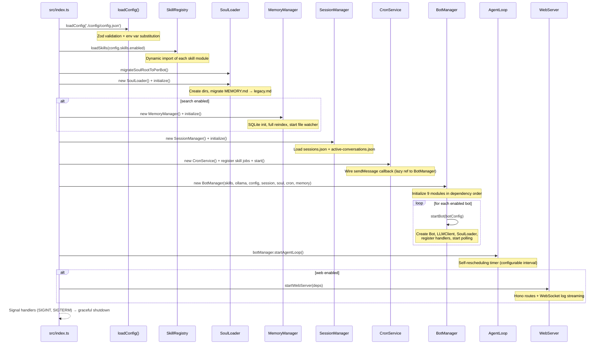
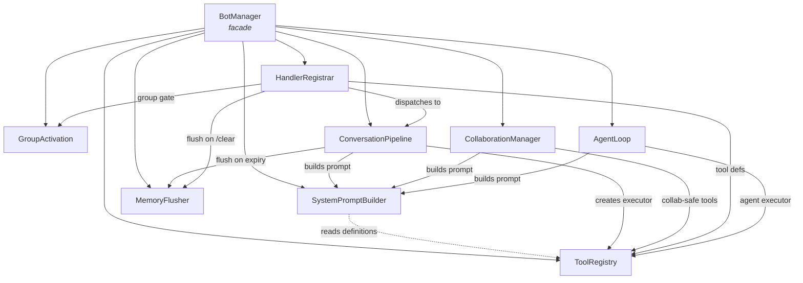

# Architecture

> Complete system architecture for AIBot Framework. A developer reading only this document should understand the entire system.

## System Overview

| Aspect | Choice |
|--------|--------|
| **Runtime** | [Bun](https://bun.sh) (runs TypeScript directly, no build step) |
| **Language** | TypeScript (strict mode) |
| **Bot framework** | [grammY](https://grammy.dev/) (Telegram Bot API) |
| **LLM backends** | Ollama (local, tool-calling), Claude CLI (Anthropic, text-only + fallback) |
| **Embedding model** | Ollama `nomic-embed-text` (768-dim) |
| **Database** | SQLite via `bun:sqlite` (memory search index) |
| **Web framework** | [Hono](https://hono.dev/) + Bun.serve (HTTP + WebSocket) |
| **Config validation** | [Zod](https://zod.dev/) |
| **Logging** | [pino](https://getpino.io/) (JSON structured logs) |

## Directory Structure

```
src/
├── index.ts                    # Entry point — startup orchestration
├── config.ts                   # Zod schemas, loadConfig(), resolveAgentConfig()
├── session.ts                  # SessionManager — JSONL transcripts, reset policies, reply window
├── soul.ts                     # SoulLoader — identity/soul/motivations/goals/memory files
├── soul-generator.ts           # AI-assisted personality generation (Claude CLI)
├── ollama.ts                   # OllamaClient — HTTP client for Ollama API
├── claude-cli.ts               # claudeGenerate() — spawns Claude CLI subprocess
├── media.ts                    # MediaHandler — photos, documents, voice (Whisper STT)
├── message-buffer.ts           # MessageBuffer — 2-layer debounce + followup queue
├── logger.ts                   # createLogger() — pino config
├── agent-registry.ts           # AgentRegistry — tracks running bots for collaboration
├── collaboration-tracker.ts    # Rate limiting for bot-to-bot messages
├── collaboration-session.ts    # CollaborationSessionManager — multi-turn internal sessions
├── humanizer-prompt.ts         # Humanizer system prompt injection
│
├── bot/                        # Bot core (modular facade pattern)
│   ├── types.ts                # BotContext interface, SeenUser
│   ├── bot-manager.ts          # BotManager facade — constructor, startBot, stopBot, public API
│   ├── tool-registry.ts        # ToolRegistry — init all tools, executor factory, disabled filtering
│   ├── system-prompt-builder.ts# SystemPromptBuilder — conversation/collaboration/autonomous modes
│   ├── memory-flush.ts         # MemoryFlusher — LLM summarization to daily memory log
│   ├── group-activation.ts     # GroupActivation — deference, LLM relevance, broadcast checks
│   ├── conversation-pipeline.ts# ConversationPipeline — RAG prefetch, LLM call, persist, reply
│   ├── collaboration.ts        # CollaborationManager — visible, internal, delegation flows
│   ├── handler-registrar.ts    # HandlerRegistrar — grammY handler registration
│   ├── agent-loop.ts           # AgentLoop — autonomous planner-executor timer
│   ├── agent-loop-prompts.ts   # Planner and executor prompt templates
│   ├── dynamic-tool-registry.ts# DynamicToolRegistry — hot-load/approve/reject dynamic tools
│   ├── telegram-utils.ts       # sendLongMessage() — message splitting for Telegram limits
│   └── index.ts                # Barrel re-export of BotManager
│
├── tools/                      # LLM tool implementations (factory pattern)
│   ├── types.ts                # Tool, ToolDefinition, ToolResult, ToolExecutor
│   ├── web-search.ts           # web_search — Brave/Google search API
│   ├── web-fetch.ts            # web_fetch — HTTP fetch + HTML-to-text
│   ├── soul.ts                 # save_memory, update_soul, update_identity
│   ├── goals.ts                # manage_goals — CRUD on structured GOALS.md
│   ├── memory-search.ts        # memory_search — semantic hybrid search
│   ├── memory-get.ts           # memory_get — read lines from a search result file
│   ├── exec.ts                 # exec — shell command execution
│   ├── file.ts                 # file_read, file_write, file_edit
│   ├── process.ts              # process — background process management
│   ├── datetime.ts             # get_datetime — current date/time with timezone
│   ├── phone-call.ts           # phone_call — Twilio voice calls + contacts
│   ├── cron.ts                 # cron — scheduled jobs/reminders
│   ├── delegate.ts             # delegate_to_bot — one-shot bot delegation
│   ├── collaborate.ts          # collaborate — multi-turn bot collaboration
│   ├── improve.ts              # improve — Claude CLI soul improvement
│   ├── create-tool.ts          # create_tool — bot-created dynamic tools
│   ├── dynamic-tool-store.ts   # DynamicToolStore — disk persistence for dynamic tools
│   ├── dynamic-tool-loader.ts  # loadDynamicTool() — runtime loader for TS/command tools
│   └── cache.ts                # TTL cache utility for web tools
│
├── memory/                     # Semantic memory search system
│   ├── types.ts                # MemorySearchResult
│   ├── manager.ts              # MemoryManager — orchestrator + file watcher
│   ├── schema.ts               # SQLite schema init, embedding serialization
│   ├── embeddings.ts           # EmbeddingService — Ollama embedding + caching
│   ├── indexer.ts              # fullReindex(), indexFile() — file → chunks → embeddings
│   ├── chunker.ts              # Token-based text chunking with overlap
│   ├── search.ts               # hybridSearch() — vector + FTS5 keyword, weighted merge
│   └── session-indexer.ts      # indexAllSessions() — JSONL transcript indexing
│
├── core/                       # Shared abstractions
│   ├── llm-client.ts           # LLMClient interface, Ollama/Claude/Fallback implementations
│   ├── skill-registry.ts       # SkillRegistry — loads skills from src/skills/
│   ├── skill-loader.ts         # loadSkill() — dynamic import of skill modules
│   └── types.ts                # Skill, SkillContext, TelegramClient, SessionInfo
│
├── skills/                     # Plugin skills (skill.json + index.ts each)
│   ├── reflection/             # Nightly self-reflection and soul evolution
│   ├── improve/                # On-demand soul improvement via Claude CLI
│   ├── calibrate/              # Model calibration
│   ├── humanizer/              # Humanizer personality injection
│   ├── intel-gatherer/         # Intelligence gathering
│   ├── phone-call/             # Phone call skill UI
│   └── example/                # Example skill template
│
├── cron/                       # CronService — schedule engine
│   └── index.ts                # 3 schedule types, REST API, disk persistence
│
└── web/                        # Web dashboard
    ├── server.ts               # Hono app, Bun.serve, WebSocket log streaming
    └── routes/                 # REST API route modules
        ├── status.ts           # GET /api/status
        ├── agents.ts           # CRUD /api/agents (+ AI soul generation)
        ├── sessions.ts         # GET /api/sessions
        ├── cron.ts             # CRUD /api/cron
        ├── settings.ts         # GET/PUT /api/settings
        ├── skills.ts           # GET /api/skills
        ├── tools.ts            # CRUD /api/tools (dynamic tool approval)
        └── agent-loop.ts       # GET/POST /api/agent-loop
```

## Startup Sequence



## Component Architecture



### Module Dependency Graph

```
BotManager (facade)
  ├── ToolRegistry            (no module deps — reads config, creates tools)
  ├── SystemPromptBuilder     (reads ToolRegistry.getDefinitionsForBot())
  ├── MemoryFlusher           (no module deps — uses BotContext services)
  ├── GroupActivation         (no module deps — uses BotContext services)
  ├── ConversationPipeline    (uses SystemPromptBuilder, MemoryFlusher, ToolRegistry)
  ├── CollaborationManager    (uses SystemPromptBuilder, ToolRegistry)
  ├── HandlerRegistrar        (uses ConversationPipeline, GroupActivation, MemoryFlusher, ToolRegistry)
  └── AgentLoop               (uses SystemPromptBuilder, ToolRegistry)
```

Modules are initialized in this order in the `BotManager` constructor. Circular dependencies between tools and `CollaborationManager` are resolved with lazy callbacks: `() => collaborationManager`.

## BotContext Pattern

All modules receive a shared `BotContext` interface (defined in `src/bot/types.ts`) containing:

- **Readonly services:** `config`, `ollamaClient`, `sessionManager`, `skillRegistry`, `cronService`, `memoryManager`, `agentRegistry`, `collaborationTracker`, `collaborationSessions`, `logger`, `mediaHandler`, `messageBuffer`
- **Per-bot mutable state (Maps):** `bots`, `activeModels`, `soulLoaders`, `llmClients`, `botLoggers`, `seenUsers`
- **Shared arrays (mutated in-place):** `tools`, `toolDefinitions`
- **Helper methods:** `getActiveModel()`, `getLLMClient()`, `getSoulLoader()`, `getBotLogger()`, `resolveBotId()`

State is shared by reference — when `ToolRegistry` pushes a new tool into `ctx.tools[]`, all modules see it immediately. This avoids prop drilling while keeping modules loosely coupled.

## Configuration System

Configuration flows through three layers:

1. **`config/config.json`** — JSON file with `${ENV_VAR}` substitution support
2. **Zod schemas** (`src/config.ts`) — Validate and apply defaults at startup
3. **`resolveAgentConfig()`** — Merges global defaults with per-bot overrides

### Config Sections

| Section | Controls |
|---------|----------|
| `bots[]` | Per-bot: id, name, token, model, llmBackend, soulDir, disabledTools, skills, conversation overrides, agentLoop overrides |
| `ollama` | Base URL, primary model, fallback models |
| `conversation` | Default system prompt, temperature, maxHistory |
| `soul` | Soul dir, search config, memoryFlush, sessionMemory, versioning |
| `session` | Data dir, reset policies (daily/idle), groupActivation mode, replyWindow, forumTopicIsolation, llmRelevanceCheck |
| `webTools` | Search API key, fetch config, maxToolRounds |
| `exec` | Timeout, allowed/denied command patterns |
| `fileTools` | Base path, max file size, denied patterns |
| `processTools` | Max sessions, TTL, max output |
| `datetime` | Timezone, locale |
| `phoneCall` | Twilio credentials, language, voice, contacts file |
| `cron` | Store path, enabled |
| `collaboration` | Max rounds, cooldown, session TTL, visible max turns, enableTargetTools |
| `buffer` | Inbound debounce ms, queue debounce ms, queue cap |
| `agentLoop` | Enabled, every (interval), maxToolRounds, maxDurationMs, disabledTools |
| `dynamicTools` | Enabled, store path, maxToolsPerBot |
| `media` | Enabled, max file size, Whisper config |
| `web` | Enabled, port, host |
| `improve` | Claude path, timeout, allowed focus areas |
| `humanizer` | Enabled |
| `logging` | Level, file path |
| `paths` | Data, logs, skills directories |

## Graceful Shutdown

On `SIGINT`/`SIGTERM`, disposal happens in reverse dependency order:

```
1. AgentLoop.stop()                — cancel timer
2. MessageBuffer.dispose()         — clear all debounce timers
3. CollaborationTracker.dispose()  — clear cooldown timers
4. CollaborationSessions.dispose() — clear TTL timers
5. Each Bot.stop()                 — stop grammY polling
6. AgentRegistry.unregister()      — remove bot entries
7. CronService.stop()              — cancel all scheduled jobs
8. SessionManager.dispose()        — flush metadata + active conversations to disk
9. MemoryManager.dispose()         — close file watcher + SQLite database
```
